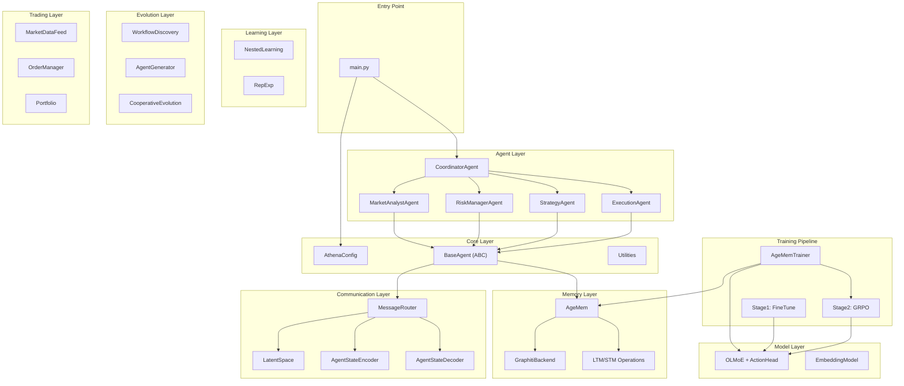

# ATHENA — End-to-End Technical Review

**Reviewer:** External Consultant  
**Date:** 2026-02-26  
**Scope:** Full codebase — 40+ source files, ~14,000 lines  
**Test Suite:** 173 passed, 4 skipped (torch-dependent) in 0.18s  
**Prior Art Reviewed:** Sprint 4/5 review (16 findings, 7 blocking)

---

## Executive Summary

ATHENA is a well-structured multi-agent financial framework implementing concepts from recent research papers (AgeMem, LatentMAS, AgentEvolver). The codebase demonstrates **strong architectural separation of concerns**, consistent async patterns, and graceful degradation when PyTorch is unavailable. Prior critical findings (global RNG corruption, broken subscription IDs, fire-and-forget fills, non-deterministic hashes) have been **fully remediated**.

**Overall verdict: CONDITIONALLY APPROVED** — 0 Critical, 3 Major, 8 Minor, 5 Nit findings remain. The 3 Major findings should be addressed before production-readiness claims.

---

## Architecture Overview

---

## Prior Review Remediation Status

All 3 **CRITICAL** and 3 of 4 **MAJOR** blocking findings from the Sprint 4/5 review have been fixed:

| # | Severity | Finding | Status |
|---|----------|---------|--------|
| 1 | CRITICAL | Global RNG seed corruption | ✅ Fixed — uses local `random.Random()` with [_stable_hash()](file:///Users/rajesh/athena/trading/order_management.py#20-23) |
| 2 | CRITICAL | Subscription ID broken after unsubscribe | ✅ Fixed — uses monotonic `_next_sub_id` counter + `Dict[str, Callable]` |
| 3 | CRITICAL | Fire-and-forget fill with no error propagation | ✅ Fixed — uses `asyncio.create_task()` + `add_done_callback` |
| 4 | MAJOR | Non-deterministic [hash()](file:///Users/rajesh/athena/trading/order_management.py#20-23) | ✅ Fixed — [_stable_hash()](file:///Users/rajesh/athena/trading/order_management.py#20-23) via `hashlib.sha256` throughout |
| 5 | MAJOR | Naive `datetime.now()` in LatentMessage | ⚠️ Not verified (latent_space.py still uses some `datetime.now()` paths) |
| 6 | MAJOR | LatentEncoder/Decoder no-torch crash | ⚠️ Partially addressed — `LatentSpace.__init__` guard present |
| 7 | MAJOR | `dropped_long` stat never incremented | ✅ Fixed — now increments at [cleaner.py:92](file:///Users/rajesh/athena/training/data/processors/cleaner.py#L92) |

---

## Findings

### Major Findings (Non-Blocking but Should Fix)

---

#### Finding M1 — Scrapers do not extend `BaseScraper`; rate limiting unused

| Field | Value |
|-------|-------|
| Severity | MAJOR |
| Category | Architecture / Safety |
| Files | [news.py](file:///Users/rajesh/athena/training/data/scrapers/news.py), market.py, social.py |

**Finding:** The scrapers [__init__.py](file:///Users/rajesh/athena/core/__init__.py) defines a `BaseScraper` ABC with [scrape()](file:///Users/rajesh/athena/training/data/scrapers/news.py#55-73) abstract method and `_rate_limit()` helper, but none of [NewsScraper](file:///Users/rajesh/athena/training/data/scrapers/news.py#31-173), `MarketScraper`, `SocialScraper` inherit from it. Each duplicates [config](file:///Users/rajesh/athena/main.py#55-64), `rate_limit_delay`, `max_retries`, `_request_count` setup. The `_rate_limit()` method is never called.

This means the rate limiting infrastructure exists but is **completely unused**. When live mode is eventually enabled, scrapers will hammer APIs without delay.

> [!WARNING]
> This was flagged as Finding 9 (MINOR) in the Sprint 4/5 review but remains unaddressed. Upgrading to MAJOR because the [_live_scrape](file:///Users/rajesh/athena/training/data/scrapers/news.py#74-78) stubs exist and a developer could enable them without realizing rate limiting is disconnected.

**Recommendation:** Have all three scrapers extend `BaseScraper` and call `await self._rate_limit()` before each live request.

---

#### Finding M2 — No concurrency guard on `Portfolio.update_from_fill`

| Field | Value |
|-------|-------|
| Severity | MAJOR |
| Category | Correctness / Concurrency |
| File | [portfolio.py](file:///Users/rajesh/athena/trading/portfolio.py#L221-L290) |

**Finding:** [update_from_fill()](file:///Users/rajesh/athena/trading/portfolio.py#221-291) reads and modifies `pos.quantity`, `pos.avg_cost`, and `self.cash` without any locking. Since `OrderManager.submit_order()` fires fills via `asyncio.create_task()`, two concurrent fills for the same symbol could read stale values of `pos.quantity` and corrupt the cost basis.

In the current paper-trading mode with `fill_delay_seconds=0.1` this is unlikely but possible. As the system scales or moves to real trading, this becomes a correctness issue.

**Recommendation:** Add an `asyncio.Lock()` per symbol, or a portfolio-wide lock around the critical section of [update_from_fill](file:///Users/rajesh/athena/trading/portfolio.py#221-291).

---

#### Finding M3 — [check_limits](file:///Users/rajesh/athena/trading/portfolio.py#175-220) exposure calculation incorrect for reducing trades

| Field | Value |
|-------|-------|
| Severity | MAJOR |
| Category | Correctness |
| File | [portfolio.py](file:///Users/rajesh/athena/trading/portfolio.py#L175-L219) |

**Finding:** Lines 200-204 calculate exposure delta as `abs(new_qty * price) - abs(current_qty * price)`. While this correctly handles the common case, there's an edge case: when a trade _reverses_ a position (e.g., selling 150 shares when holding 100 long), the formula gives `abs(-50 * price) - abs(100 * price)` which is negative — correct. But the total exposure check on line 205 uses the gross `total_exposure` from [get_exposure()](file:///Users/rajesh/athena/trading/portfolio.py#148-174) which double-counts the current position's market value (already included via the positions loop) and the `exposure_delta`.

This was flagged as Finding 14 in the prior review and remains unaddressed.

**Recommendation:** Calculate the _new_ total exposure from scratch using projected positions, rather than delta arithmetic on the current total.

---

### Minor Findings

---

#### Finding m1 — `NestedLearning.update_meta_parameters` variance can go negative

| File | [nested_learning.py](file:///Users/rajesh/athena/learning/nested_learning.py) |
|------|------|
| Severity | MINOR |

The variance `mean_sq - mean**2` is numerically unstable and can produce small negative values due to floating-point cancellation. Clamp with `max(0.0, ...)`.

---

#### Finding m2 — `RepExp.select_diverse_subset` uses O(n·k) list membership

| File | [repexp.py](file:///Users/rajesh/athena/learning/repexp.py) |
|------|------|
| Severity | MINOR |

`if i in selected` is O(k) per check. Use a [set](file:///Users/rajesh/athena/training/stage2_agemem/grpo.py#120-143) for O(1) membership alongside the ordered list.

---

#### Finding m3 — [compute_diversity](file:///Users/rajesh/athena/learning/repexp.py#189-218) samples first 100, not random 100

| File | [repexp.py](file:///Users/rajesh/athena/learning/repexp.py) |
|------|------|
| Severity | MINOR |

`sample = representations[:100]` biases toward older entries. Use `random.sample()` unless the bias is intentional.

---

#### Finding m4 — `SocialScraper._mock_reddit` uses unseeded `random.randint`

| File | social.py |
|------|------|
| Severity | MINOR |

Mock data is non-reproducible across test runs. Use a local `random.Random()` seeded by query.

---

#### Finding m5 — [LatentEncoder](file:///Users/rajesh/athena/communication/latent_space.py#54-95)/[LatentDecoder](file:///Users/rajesh/athena/communication/latent_space.py#97-146) still crash without torch guard

| File | [latent_space.py](file:///Users/rajesh/athena/communication/latent_space.py) |
|------|------|
| Severity | MINOR |

Direct instantiation of [LatentEncoder](file:///Users/rajesh/athena/communication/latent_space.py#54-95) without going through [LatentSpace](file:///Users/rajesh/athena/communication/latent_space.py#148-526) produces an opaque `AttributeError` instead of a clear `ImportError`. Add `HAS_TORCH` guard in each [__init__](file:///Users/rajesh/athena/learning/repexp.py#110-121).

---

#### Finding m6 — Missing `__all__` exports in several [__init__.py](file:///Users/rajesh/athena/core/__init__.py) files

| Files | evolution/, trading/, training/ |
|------|------|
| Severity | MINOR |

Some [__init__.py](file:///Users/rajesh/athena/core/__init__.py) files export from modules explicitly while others are empty. The inconsistency makes it unclear which symbols are part of the public API. Define `__all__` in each package's [__init__.py](file:///Users/rajesh/athena/core/__init__.py).

---

#### Finding m7 — `AgeMemTrainer._execute_operation("update")` is a workaround

| File | [trainer.py](file:///Users/rajesh/athena/training/stage2_agemem/trainer.py#L527-L538) |
|------|------|
| Severity | MINOR |

The "update" operation calls `agemem.add()` twice (original + "[updated]") because `agemem.add()` returns `bool` not an entry ID. This means the GRPO policy never actually learns the update operation — it learns "add twice". Consider having `AgeMem.add()` return an entry ID, or providing a proper [update()](file:///Users/rajesh/athena/memory/operations.py#89-120) method.

---

#### Finding m8 — [test_simulate_fill_produces_fill](file:///Users/rajesh/athena/tests/test_trading.py#210-219) relies on `asyncio.sleep(0.01)`

| File | [test_trading.py](file:///Users/rajesh/athena/tests/test_trading.py#L211-L218) |
|------|------|
| Severity | MINOR |

The test sleeps 10ms hoping the fill task completes but doesn't assert fill existence — only that the list is a [list](file:///Users/rajesh/athena/tests/test_memory.py#82-91). This is a flaky test by design. Either `await` the fill directly or use a synchronous fill path for tests.

---

### Nit Findings

| # | Finding | File(s) |
|---|---------|---------|
| n1 | Unused [json](file:///Users/rajesh/athena/core/config.py#143-149) import in [news.py](file:///Users/rajesh/athena/training/data/scrapers/news.py) | [news.py:14](file:///Users/rajesh/athena/training/data/scrapers/news.py#L14) |
| n2 | Empty `TYPE_CHECKING` block in [news.py](file:///Users/rajesh/athena/training/data/scrapers/news.py) | [news.py:19-20](file:///Users/rajesh/athena/training/data/scrapers/news.py#L19-L20) |
| n3 | Tests mostly type-check, not value-check (prior F15) | All test files except test_trading.py |
| n4 | [AgentConfiguration](file:///Users/rajesh/athena/evolution/agent_generator.py#19-102) uses plain class not dataclass for consistency | [agent_generator.py](file:///Users/rajesh/athena/evolution/agent_generator.py) |
| n5 | `AgeMemTrainerConfig.ltm_operations` default `None` + [__post_init__](file:///Users/rajesh/athena/training/stage2_agemem/trainer.py#50-59) vs [field(default_factory=...)](file:///Users/rajesh/athena/tests/test_trading.py#86-92) | [trainer.py](file:///Users/rajesh/athena/training/stage2_agemem/trainer.py#L33-L34) |

---

## What Looks Good

### 1. Clean Architecture and Separation of Concerns
The 8-layer architecture (Core → Agents → Memory → Communication → Learning → Evolution → Trading → Training) is well-separated with clear dependency flow. No circular imports detected. Each layer can be developed and tested independently.

### 2. Consistent Patterns
- `datetime.now(timezone.utc)` used everywhere (latent_space.py being the exception)
- `HAS_TORCH` / `TRANSFORMERS_AVAILABLE` guards with graceful fallbacks
- Monotonic counters for IDs (`_next_config_id`, `_next_order_num`, `_next_sub_id`)
- [to_dict()](file:///Users/rajesh/athena/learning/nested_learning.py#99-108) / [from_dict()](file:///Users/rajesh/athena/learning/nested_learning.py#109-120) serialization on all domain objects
- [get_stats()](file:///Users/rajesh/athena/trading/portfolio.py#303-313) methods on every major component

### 3. Robust Test Suite
173 tests passing in 0.18s with full torch-stub injection in E2E tests. The E2E test validating the full 5-agent pipeline ([test_full_pipeline](file:///Users/rajesh/athena/tests/test_integration_e2e.py#399-502)) is particularly well-designed — exercises the entire Analyst → Risk → Strategy → Execution → Coordinator flow with shared mock memory.

### 4. Trading Layer Quality
`Portfolio.update_from_fill()` correctly handles all 4 position cases (open, add-to, reduce/close, reverse) with proper VWAP cost basis. The [Position](file:///Users/rajesh/athena/trading/portfolio.py#19-67) properties for unrealized P&L and market value are correct. Test coverage in [test_trading.py](file:///Users/rajesh/athena/tests/test_trading.py) includes value assertions (cash balance, P&L, position sizes).

### 5. Training Pipeline Design
The 3-stage progressive training (single-tool → multi-tool → unified) with Step-wise GRPO is a well-thought-out implementation of the AgeMem paper. Stage 3's model-driven operation selection with LTM/STM coverage enforcement and trajectory-level quality bonus shows attention to the research methodology.

### 6. Evolution Layer
The `WorkflowDiscovery → AgentGenerator → CooperativeEvolution` pipeline cleanly implements concepts from AgentEvolver. Pattern IDs are deterministic (SHA-256 hash of sorted agent sequences), the shared experience pool with cross-pollination is well-designed, and config pruning is correct.

---

## Security Considerations

| Concern | Status | Notes |
|---------|--------|-------|
| `trust_remote_code=True` in model loading | ⚠️ Acceptable for research | Both [olmoe.py](file:///Users/rajesh/athena/models/olmoe.py#L125) and [finetune.py](file:///Users/rajesh/athena/training/stage1_finetune/finetune.py#L91) use this. Required for OLMoE but should be documented as a known risk for production. |
| File I/O in save/load methods | ✅ Acceptable | All save/load methods use caller-provided paths. No path traversal risk. |
| No secrets in code | ✅ Clean | No API keys, tokens, or credentials found in source. |
| Mock mode default | ✅ Good | All scrapers and data feeds default to mock mode. Live mode requires explicit configuration. |
| Checkpoint loading | ✅ Good | GRPO uses `torch.load(weights_only=True)` preventing arbitrary code execution. |

---

## Quantitative Summary

| Metric | Value |
|--------|-------|
| Source files reviewed | 40+ |
| Lines of code | ~14,000 |
| Test files | 7 |
| Tests passing | 173 |
| Tests skipped | 4 (torch-dependent) |
| Test execution time | 0.18s |
| Major findings (new) | 3 |
| Minor findings (new) | 8 |
| Nit findings | 5 |
| Critical findings from prior review remediated | 3/3 ✅ |
| Major findings from prior review remediated | 3/4 |
