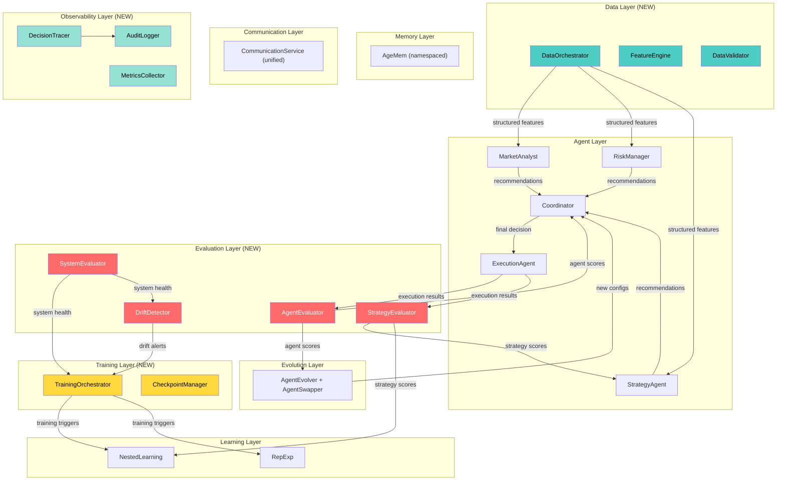

# ATHENA Architecture Review & Gap Analysis

**Date:** 2025-02-23  
**Scope:** Fundamental architecture assessment — is the design sound, complete, and production-viable?  
**Inputs:** Architecture PDF, `design.md` (1139 lines), all 58 source files, academic papers (AgeMem, LatentMAS, AgentEvolver, RepExp)  
**Verdict:** Strong foundation with **5 significant architectural gaps** that should be addressed before integration work continues

---

## 1 · What the Architecture Gets Right

Before diving into gaps, it's worth acknowledging the architectural strengths:

| Strength | Assessment |
|----------|-----------|
| **Agent abstraction** | Clean `BaseAgent` → `think()`/`act()` lifecycle is a solid, extensible contract |
| **Separation of concerns** | Agent, Memory, Communication, Evolution, Learning are properly layered |
| **Conflict resolution** | Priority-weighted voting with risk veto is a well-designed pattern for trading |
| **Communication design** | LatentMAS with both passthrough (current) and neural (future) paths is forward-looking |
| **Config system** | Hierarchical dataclass config with YAML/JSON serialization is clean |
| **Evolution approach** | Workflow discovery → agent generation → cooperative replay is a novel feedback loop |

The **5-layer decomposition** is architecturally sound. The issue is not that any layer is badly designed — it's that **critical cross-cutting concerns have no home in the architecture** and **key feedback loops are missing**.

---

## 2 · The 5 Missing Architectural Components

### Gap 1: No Evaluation / Performance Monitoring Layer 🔴

**Problem:** There is no systematic way to measure whether agents, strategies, or the system as a whole are performing well.

**What exists today:**
- `get_stats()` methods on individual components (operational counters only)
- `AgeMem.get_operation_reward()` — hardcoded composite reward (not real measurement)
- Backtesting in `StrategyAgent` — but embedded inside the agent, not a system-level capability

**What's missing:**

```
                         ┌─────────────────────────────┐
                         │    EVALUATION LAYER          │
                         │                             │
  Agent decisions ──────►│  • Agent performance scoring │
  Execution results ────►│  • Strategy P&L attribution  │
  Portfolio state ──────►│  • Risk-adjusted returns     │
  Memory operations ────►│  • Memory quality metrics    │
                         │  • Communication efficiency  │
                         │  • System-level KPIs         │
                         │  • Drift detection           │
                         │  • A/B testing framework     │
                         │                             │
                         │         ▼                   │
                         │  Evaluation Reports ────────►│ Evolution Layer (fitness)
                         │                     ────────►│ Learning Layer (rewards)
                         │                     ────────►│ Coordinator (weight tuning)
                         └─────────────────────────────┘
```

**Why this matters:**
- **Evolution layer needs fitness scores** — `WorkflowDiscovery` uses boolean `outcome` (success/fail), but what defines success? Currently hardcoded by caller.
- **Learning layer needs reward signals** — `NestedLearning` adapts based on `mean_reward`, but where do rewards come from? Currently synthetic.
- **Coordinator weights are static** — risk=3, strategy=2, analyst=1. These should adapt based on which agent has been most accurate recently.
- **No way to detect model/strategy drift** — if market regime changes and a strategy stops working, nothing triggers adaptation.

**Recommended components:**

| Component | Responsibility |
|-----------|---------------|
| `AgentEvaluator` | Score individual agents: prediction accuracy, recommendation quality, calibration |
| `StrategyEvaluator` | Track strategy P&L, Sharpe, drawdown per strategy type over time |
| `SystemEvaluator` | End-to-end metrics: total P&L, risk-adjusted return, decision quality |
| `DriftDetector` | Monitor distribution shifts in market data, agent behavior, and strategy performance |
| `EvaluationStore` | Persistent storage of evaluation results for trend analysis |

---

### Gap 2: No Data Layer / Data Abstraction 🔴

**Problem:** Agents consume market data via `context.metadata["prices"]` (a raw `List[float]`), but there's no architectural contract for how data flows into the system.

**What exists today:**
- `MarketDataFeed` (trading layer) — generates mock OHLCV
- `Scrapers` (training layer) — fetch news/market/social data
- But **no component connects these to the agents**

**The missing piece:**

```
                    ┌────────────────────────────────────┐
                    │          DATA LAYER                 │
                    │                                    │
  MarketDataFeed ──►│  • Data normalization              │
  Scrapers ────────►│  • Feature engineering pipeline    │
  External APIs ───►│  • Data validation & quality checks│
                    │  • Cache management                │
                    │  • Data versioning                 │
                    │  • Backfill / replay capability    │
                    │                                    │
                    │           ▼                        │
                    │  AgentContext.metadata (structured) │
                    └────────────────────────────────────┘
```

**Why this matters:**
- Agents currently assume data magically appears in `context.metadata`. There's no code that populates this.
- `MarketDataFeed` outputs `OHLCV` dataclass, but agents expect `{"prices": List[float], "news": List[str]}` — type mismatch.
- No feature engineering sits between raw data and agent consumption.
- The data format isn't validated — agents will silently produce garbage if given bad input.

**Recommended components:**

| Component | Responsibility |
|-----------|---------------|
| `DataOrchestrator` | Coordinates data collection from all sources on each tick |
| `FeatureEngine` | Transforms raw OHLCV + text into structured features for agents |
| `DataValidator` | Validates data completeness, freshness, and range before agent consumption |
| `DataAdapter` | Converts between `MarketDataFeed.OHLCV` format and agent `context.metadata` format |

---

### Gap 3: No Observability / Logging Infrastructure 🟡

**Problem:** Each component logs independently via `logging.getLogger(__name__)`, but there's no structured observability framework.

**What exists today:**
- Python `logging` throughout (good for development)
- `get_stats()` methods returning dicts (operational counters)

**What's missing:**
- **Structured event tracing** — cannot trace a decision from market data → analyst recommendation → coordinator vote → execution order
- **Metrics export** — no Prometheus/StatsD/OpenTelemetry integration
- **Decision audit trail** — critical for regulatory compliance in trading
- **Latency tracking** — no measurement of agent think/act cycle times
- **Alerting** — no thresholds or alert channels

**Why this matters for trading specifically:**
- Financial regulators (SEC, FINRA) require audit trails for algorithmic trading decisions
- If an agent makes a bad trade, you need to trace exactly why: which data, which analysis, which vote, which execution parameters
- The coordinator resolves conflicts but doesn't log *why* it chose one action over another in a retrievable, structured format

**Recommended components:**

| Component | Responsibility |
|-----------|---------------|
| `DecisionTracer` | Traces each decision through the full pipeline with correlation IDs |
| `MetricsCollector` | Collects and exports time-series metrics (latency, throughput, accuracy) |
| `AuditLogger` | Immutable, structured logging of all trading decisions for compliance |

---

### Gap 4: No Training Orchestration Layer 🟡

**Problem:** The architecture defines what gets trained (OLMoE, AgeMem GRPO, LatentMAS encoder/decoder) but has no orchestration for *when* or *how* training happens.

**What exists today:**
- `grpo.py` — GRPO algorithm (structurally complete but functionally a no-op)
- `stage1_finetune/`, `stage2_agemem/` — empty `__init__.py` scaffolding
- `FinanceDataset`, `AgentTrajectoryDataset` — data loading is ready
- `NestedLearning` — meta-parameter adaptation (heuristic, not gradient-based)

**What's missing:**

```
                 ┌──────────────────────────────────────┐
                 │    TRAINING ORCHESTRATION LAYER       │
                 │                                      │
                 │  ┌──────────┐  ┌────────────────┐   │
                 │  │ Stage 1  │  │ Stage 2        │   │
                 │  │ OLMoE    │  │ AgeMem GRPO    │   │
                 │  │ SFT/DPO  │  │ Memory Ops RL  │   │
                 │  └────┬─────┘  └──────┬─────────┘   │
                 │       │               │              │
                 │  ┌────┴─────┐  ┌──────┴─────────┐   │
                 │  │ Stage 3  │  │ Stage 4        │   │
                 │  │ LatentMAS│  │ End-to-end     │   │
                 │  │ Enc/Dec  │  │ Multi-agent    │   │
                 │  └──────────┘  └────────────────┘   │
                 │                                      │
                 │  • Training scheduler                │
                 │  • Checkpoint management              │
                 │  • Evaluation-gated promotion          │
                 │  • Rollback on performance regression  │
                 └──────────────────────────────────────┘
```

**Why this matters:**
- Training needs to happen in a specific order (fine-tune model → train memory management → train communication → end-to-end)
- There's no mechanism to decide *when* to retrain (schedule-based? performance-based? drift-based?)
- No checkpoint management or model versioning
- No evaluation gate: a newly trained model could perform worse, and nothing prevents it from being deployed

---

### Gap 5: Incomplete Feedback Loops 🟡

**Problem:** The architecture has forward paths (data → analysis → decision → execution) but the backward paths (execution results → agent improvement) are incomplete or absent.

**Current feedback loops:**

| Loop | Status | Issue |
|------|--------|-------|
| Execution → Memory | ⚠️ Partial | Agents store to memory, but don't learn from past mistakes |
| Memory → Agents | ⚠️ Partial | Agents retrieve from memory, but memory quality is not measured |
| Evolution → Agents | ❌ Missing | `AgentGenerator` creates configs, but no mechanism deploys or swaps agents |
| Evaluation → Coordinator | ❌ Missing | Coordinator weights are static (risk=3, strategy=2, analyst=1) |
| Evaluation → Learning | ❌ Missing | `NestedLearning` has `adapt_to_task()` but nobody calls it |
| Execution → Strategy | ❌ Missing | Strategy doesn't know if its signals led to profitable trades |
| Market regime → Strategy selection | ⚠️ Partial | Strategy detects regime but doesn't learn which strategy works best per regime |

**The key missing feedback loop:**

```
                    ┌──────────────────────────┐
                    │        EXECUTION         │
                    │     (trade results)      │
                    └─────────┬────────────────┘
                              │ fill price, P&L, slippage
                              ▼
                    ┌──────────────────────────┐
                    │       EVALUATION         │ ◄── Gap 1
                    │  (was this a good trade?) │
                    └─────────┬────────────────┘
                              │ performance scores
                    ┌─────────┼────────────┐
                    ▼         ▼            ▼
              ┌──────────┐ ┌────────┐ ┌────────────┐
              │ Strategy │ │ CoordW │ │  Learning  │
              │ (learn   │ │ (adapt │ │ (meta-     │
              │  which   │ │ agent  │ │  params)   │
              │  works)  │ │ weight)│ │            │
              └──────────┘ └────────┘ └────────────┘
```

Without this feedback loop, **the system cannot learn from its own trades**. It will repeat the same mistakes because no signal flows backward from execution outcomes to the decision-making layers.

---

## 3 · Structural Design Issues

### 3.1 Dual Communication Paths (LatentSpace vs MessageRouter)

The architecture has **two parallel, incompatible communication systems**:

1. **LatentSpace** — used by `BaseAgent._build_context()` via `self.communication.receive()`
2. **MessageRouter** — used by the coordinator's `initialize_communication()` and agent `self.router.send()`

These don't interoperate cleanly:
- `LatentSpace.receive()` returns `List[AgentMessage]` (high-level)
- `MessageRouter.receive()` returns `List[decoded tensors]` (low-level)
- Agents use `self.router.send()` in `act()` but `self.communication.receive()` (LatentSpace) in `_build_context()`

**Recommendation:** Unify into a single `CommunicationService` that abstracts over the transport layer. Agents should send and receive through one interface.

---

### 3.2 No Agent Lifecycle Management

Agents are instantiated once and run forever. There's no concept of:
- **Agent health checks** — detecting when an agent is stuck, errored, or producing garbage
- **Agent restart** — recovering from a crashed agent without losing system state
- **Agent hot-swap** — replacing an agent with a better configuration from `AgentGenerator`
- **Graceful degradation** — continuing operation when one agent is down (e.g., trading without sentiment if MarketAnalyst fails)

The `AgentState` enum has `ERROR` state, but nothing monitors it or takes action.

---

### 3.3 Single-Threaded Coordination

The coordinator processes agents sequentially:
1. Collects all recommendations (from messages already in queue)
2. Resolves conflicts
3. Makes decision
4. Broadcasts

But agents run independently — there's **no synchronization barrier** ensuring all agents have completed their analysis before the coordinator decides. In practice:
- If MarketAnalyst is slow, the coordinator may decide with only Risk + Strategy inputs
- If execution feedback arrives late, it's ignored for the current cycle

**Recommendation:** Add a `SynchronizationBarrier` to the coordination cycle that waits for required agents (with timeout + degraded-mode fallback).

---

### 3.4 Memory Doesn't Differentiate Between Agent Types

All agents share the same `AgeMem` instance and retrieve using task-string queries. There's no namespacing or access control:
- MarketAnalyst's memories are searchable by ExecutionAgent
- Risk alerts stored by RiskManager might pollute StrategyAgent's context retrieval
- No memory "schemas" — agents store free-form dicts

**Recommendation:** Add agent-scoped namespaces to memory (e.g., `memory.retrieve(query, scope="market_analyst")`) and define memory schemas per agent type.

---

## 4 · Architecture Improvements

### 4.1 What I'd Change About Existing Layers

| Layer | Current Design | Proposed Improvement |
|-------|---------------|---------------------|
| **Agent** | Static priority weights | Dynamic weights that adapt based on recent accuracy per agent |
| **Agent** | `done` semantics vary by agent | Standardize: `done=True` means "I have produced my output for this cycle" |
| **Communication** | Two parallel systems | Single `CommunicationService` interface with pluggable transports |
| **Memory** | Flat namespace, free-form content | Agent-scoped namespaces with typed memory entries |
| **Evolution** | Generates configs but can't deploy them | Add `AgentSwapper` that can hot-swap underperforming agents |
| **Coordinator** | Single-pass, no re-query capability | Add "request more info" action type for incomplete inputs |
| **Learning** | Heuristic adaptation only | Connect to real gradient signals from GRPO training pipeline |

### 4.2 Proposed Revised Architecture



---

## 5 · Priority Recommendations

### Tier 1 — Must Have (address before production)

| # | Gap | Effort | Impact |
|---|-----|--------|--------|
| 1 | **Evaluation Layer** — agent scoring, strategy P&L tracking, drift detection | 2-3 weeks | Without this, the system cannot learn, improve, or know when it's failing |
| 2 | **Data Layer** — connect `MarketDataFeed` to agents with feature engineering | 1 week | Without this, agents have no input data |
| 3 | **Feedback loops** — execution results → strategy learning, evaluation → coordinator weights | 2 weeks | Without this, the system repeats mistakes |

### Tier 2 — Should Have (address for robustness)

| # | Gap | Effort | Impact |
|---|-----|--------|--------|
| 4 | **Unified communication** — merge LatentSpace + MessageRouter into one interface | 1 week | Eliminates confusion and potential message loss |
| 5 | **Observability** — decision tracing, structured metrics, audit logging | 1-2 weeks | Required for debugging, monitoring, and regulatory compliance |
| 6 | **Agent lifecycle management** — health checks, restart, hot-swap | 1 week | Required for any long-running deployment |

### Tier 3 — Nice to Have (address for scale)

| # | Gap | Effort | Impact |
|---|-----|--------|--------|
| 7 | **Training orchestration** — staged training scheduler, checkpoint management | 2-3 weeks | Required for actual model training |
| 8 | **Memory namespacing** — agent-scoped, typed memory entries | 1 week | Prevents cross-agent memory pollution |
| 9 | **Synchronization barriers** — coordinate agent timing within cycles | 1 week | Prevents decisions on incomplete data |

---

## 6 · Summary

The ATHENA architecture is **fundamentally sound in its forward path** — data flows cleanly from analysis through decision to execution. The five-layer decomposition is well-designed and the individual components are well-implemented.

The critical weakness is the **absence of backward paths**: no evaluation, no feedback loops, no learning from outcomes. The system can make trading decisions but cannot assess whether they were good decisions, and therefore cannot improve.

> [!IMPORTANT]
> **The single most impactful architectural addition is an Evaluation Layer.** It unlocks every other improvement: evolution needs fitness scores, learning needs reward signals, the coordinator needs agent accuracy metrics, and operators need drift detection.

Think of it this way: the current architecture is a **car with an engine, transmission, and wheels, but no dashboard, no speedometer, and no rearview mirror**. It can drive, but you have no idea how fast you're going, where you've been, or whether you're about to crash.

---

*Architecture review based on analysis of the ATHENA Architecture Document (PDF), `design.md` (1139 lines), all 58 source files, and academic papers (AgeMem, LatentMAS, AgentEvolver, RepExp).*
