# ATHENA Full Project Technical Review (Rev 2)

**Date:** 2025-02-23  
**Scope:** Complete codebase re-review — all 28+ source files across 7 layers  
**Status:** Post-Sprint 2, mid-integration  
**Delta from Rev 1:** Agent memory/router wiring, new `learning/` module, new `tests/` directory

---

## Executive Summary

Since the first review, significant integration work has been completed. All 5 agents now accept `memory` and `router` parameters, call `self.memory.retrieve()` / `self.memory.add()` and `self.router.send()` / `self.router.receive()`. The coordinator has a full `initialize_communication()` method. A test suite (`tests/test_integration_e2e.py`) exercises every agent independently and as a full 5-agent pipeline. A new `learning/nested_learning.py` provides the bilevel meta-learning framework from the architecture document.

However, **6 of the 7 original blockers remain**, several code-level bugs from Rev 1 are unfixed, and the new test suite and learning module each introduce new findings. This review identifies **28 findings** total: **6 blockers, 14 should-fix, 8 informational**.

---

## What Changed Since Rev 1

| Area | Change | Impact |
|------|--------|--------|
| All 5 agents | Accept `memory` and `router` params; call retrieve/add/send/receive | Partially addresses B1 (pipeline), B3 (memory) |
| [coordinator.py](file:///Users/rajesh/athena/agents/coordinator.py) | New `initialize_communication()`, `register_agent()`, and LatentMAS broadcast in `act()` | Pipeline orchestration is wired |
| [nested_learning.py](file:///Users/rajesh/athena/learning/nested_learning.py) | New 461-line bilevel meta-learning framework (inner/outer loop, knowledge consolidation) | Addresses architecture doc's RepExp gap |
| [test_integration_e2e.py](file:///Users/rajesh/athena/tests/test_integration_e2e.py) | 8 pytest tests with `MockAgeMem`, `MockRouter`, torch stubs | Partially addresses B5 (no tests) |
| [encoder.py](file:///Users/rajesh/athena/communication/encoder.py) | Better `HAS_TORCH` gating with dummy class fallbacks at module level | Partially addresses B7 |

---

## Finding Summary

| Severity | Count | Category |
|----------|-------|----------|
| 🔴 Blocker | 6 | Integration, correctness, security |
| 🟡 Should-fix | 14 | Bugs, performance, robustness |
| 🔵 Informational | 8 | Tech debt, documentation, design |

---

## 🔴 Blocker Findings

### B1 — Pipeline Orchestration Exists but Lacks an Entry Point *(was: No Pipeline)*

**Status:** Partially mitigated  

Agents are now wired to receive memory and router instances. The coordinator has `initialize_communication()` and `register_agent()`. **However**, there is no `main.py`, CLI, or entry point that instantiates everything and runs a trading cycle. The test suite does this via fixtures, but that is test infrastructure, not a production entry point.

**Recommendation:** Create a minimal `athena/main.py` that composes all components and runs one cycle.

---

### B2 — No LLM Integration in Agents *(unchanged)*

All agents use hardcoded rule-based logic. `OLMoEModel` exists in `models/olmoe.py` but is never imported by any agent. No prompt templates exist.

---

### B4 — Untrained Encoder/Decoder Produce Garbage *(unchanged)*

The `_original_content` passthrough works, but the neural communication path remains untrained.

---

### B6 — No Market Data or Broker Integration *(unchanged)*

All data is synthetic. No data provider, OMS, or broker API.

---

### B7 — Communication Package Import Gating Is Fragile *(partially mitigated)*

**File:** [encoder.py](file:///Users/rajesh/athena/communication/encoder.py) L19–29  

`encoder.py` now defines dummy `torch` and `nn` classes when PyTorch is absent, which is better than before. However:
- [latent_space.py](file:///Users/rajesh/athena/communication/latent_space.py) still defines `LatentEncoder(nn.Module)` and `LatentDecoder(nn.Module)` at module scope without a `HAS_TORCH` guard
- [decoder.py](file:///Users/rajesh/athena/communication/decoder.py) likely has the same issue
- The test suite works around this with a comprehensive torch stub injected before any import, but production code paths remain fragile

---

### B8 — Test Suite Cannot Run (pytest Not Installed) *(new)*

`pytest` and `pytest-asyncio` are not in any `requirements.txt` or `setup.py`. Running `python3 -m pytest` fails with `No module named pytest`. The tests exist but cannot be executed without manual dependency installation.

**Recommendation:** Add a `requirements-dev.txt` or `pyproject.toml` with test dependencies.

---

## 🟡 Should-Fix Findings

### S1 — `RiskManagerAgent.think()` Still Returns `done: False` *(unfixed)*

**File:** [risk_manager.py](file:///Users/rajesh/athena/agents/risk_manager.py) L181  
The non-empty-positions path always returns `done: False`. The empty-positions early return correctly sets `done: True` (L140), but the main computation path never signals completion.

---

### S2 — O(n²) MACD Computation Still Present *(unfixed)*

**File:** [market_analyst.py](file:///Users/rajesh/athena/agents/market_analyst.py) L344–347  
```python
for i in range(26, len(price_data) + 1):
    ema12 = self._calculate_ema(price_data[:i], 12)  # O(n) per call
    ema26 = self._calculate_ema(price_data[:i], 26)  # O(n) per call
```
Each iteration calls `_calculate_ema` which iterates over the full slice. For 1000 data points: ~500K multiplications.

---

### S3 — Backtest `total_return` Still Additive *(unfixed)*

**File:** [strategy_agent.py](file:///Users/rajesh/athena/agents/strategy_agent.py) L615  
`total_return = sum(returns)` while `max_drawdown` uses multiplicative compounding (L620–629). Inconsistent.

---

### S4 — Non-Deterministic Execution Simulation *(unfixed)*

**File:** [execution_agent.py](file:///Users/rajesh/athena/agents/execution_agent.py) L490  
`random.random()` in `_simulate_fill()` is still unseeded.

---

### S5 — Coordinator `_allocate_resources` Docstring Says Round-Robin *(unfixed)*

**File:** [coordinator.py](file:///Users/rajesh/athena/agents/coordinator.py) L505  
Docstring says "round-robin" but implementation is proportional allocation. The string `"round_robin"` is also returned in the method field (L539).

---

### S6 — `_parse_trade_request` Returns Wrong `side` Type

**File:** [execution_agent.py](file:///Users/rajesh/athena/agents/execution_agent.py) L554  
```python
"side": trade_request.get("side", OrderSide.BUY),
```
But the test passes `"action": "buy"` (a string), not an `OrderSide` enum. If a string `"buy"` is passed, comparisons against `OrderSide.BUY` later in the code (e.g., L492, L498, L533) will silently fail, producing incorrect slippage direction.

---

### S7 — `MockAgeMem.add()` Signature Doesn't Match Real `AgeMem`

**File:** [test_integration_e2e.py](file:///Users/rajesh/athena/tests/test_integration_e2e.py) L104  
`MockAgeMem.add(content, metadata=None)` returns `bool`, but agents call `await self.memory.add(content=..., metadata=...)`. If the real `AgeMem.add()` returns a string (memory ID) instead of bool, the mock hides the divergence. The mock should match the real interface exactly.

---

### S8 — Coordinator Stores Two Memory Entries Per `act()` Call

**File:** [coordinator.py](file:///Users/rajesh/athena/agents/coordinator.py) L318–346  
`act()` calls `self.memory.add()` twice: once with the full result (L320) and once with a coordination summary (L334). This doubles memory consumption for every coordination cycle without clear benefit.

---

### S9 — `NestedLearning.adaptation_history` Is Unbounded

**File:** [nested_learning.py](file:///Users/rajesh/athena/learning/nested_learning.py) L160  
`self.adaptation_history: List[Dict[str, Any]] = []` grows without limit. Unlike `task_trajectories` which gets pruned in `consolidate_knowledge()`, `adaptation_history` is never trimmed.

---

### S10 — Sync File I/O in `NestedLearning.save_state()` / `load_state()`

**File:** [nested_learning.py](file:///Users/rajesh/athena/learning/nested_learning.py) L424, L438  
Both methods are `async def` but use synchronous `open()` / `json.dump()` / `json.load()`. This blocks the event loop.

---

### S11 — `consolidate_knowledge()` Top-Tasks Logic May Be Wrong

**File:** [nested_learning.py](file:///Users/rajesh/athena/learning/nested_learning.py) L337  
```python
top_tasks = [tid for tid, m in task_means.items() if m >= mean_reward]
```
`mean_reward` is computed from **recent** trajectories only (last `recent_window`), but `task_means` uses **all** trajectories per task. Comparing across different data windows can misidentify top tasks.

---

### S12 — Sync File I/O in Evolution Layer *(unfixed from Rev 1)*

**Files:** [workflow_discovery.py](file:///Users/rajesh/athena/evolution/workflow_discovery.py), [cooperative_evolution.py](file:///Users/rajesh/athena/evolution/cooperative_evolution.py), [agent_generator.py](file:///Users/rajesh/athena/evolution/agent_generator.py)  
All `save_*`/`load_*` methods remain async with synchronous I/O.

---

### S13 — `learning/__init__.py` Exports Nothing

**File:** [learning/__init__.py](file:///Users/rajesh/athena/learning/__init__.py)  
The file has only a docstring — no imports, no `__all__`. Users must know to import `learning.nested_learning.NestedLearning` directly.

---

### S14 — Test Suite Uses Broad Torch Stub That May Mask Real Failures

**File:** [test_integration_e2e.py](file:///Users/rajesh/athena/tests/test_integration_e2e.py) L28–48  
The torch stub replaces `nn.Module`, `nn.Linear`, `torch.zeros`, etc. with no-ops. Any code path that actually constructs or calls a PyTorch module will silently pass with garbage results rather than reporting that PyTorch is needed.

---

## 🔵 Informational Findings

### I1 — Hardcoded Quality Rewards in AgeMem *(unchanged)*

**File:** [agemem.py](file:///Users/rajesh/athena/memory/agemem.py) — `_calculate_quality_reward()` returns fixed values.

### I2 — GraphitiBackend `update_episode` is a No-Op *(unchanged)*

**File:** [graphiti_backend.py](file:///Users/rajesh/athena/memory/graphiti_backend.py) L228–232

### I3 — Message ID Generation Uses `random.random()` *(unchanged)*

**Files:** Multiple — use `uuid.uuid4()` instead.

### I4 — Character-Code Tokenization Is a Dead-End *(unchanged)*

**File:** [latent_space.py](file:///Users/rajesh/athena/communication/latent_space.py), [encoder.py](file:///Users/rajesh/athena/communication/encoder.py)

### I5 — `AgentStateEncoder`/`LatentSpace` Default Dimension Mismatch *(unchanged)*

Encoder defaults to `latent_dim=256`, `LatentSpace` defaults to `latent_dim=512`.

### I6 — `EmbeddingModel` Is Never Used *(unchanged)*

**File:** [embeddings.py](file:///Users/rajesh/athena/models/embeddings.py)

### I7 — No Graceful Shutdown or Error Recovery *(unchanged)*

No health checks, circuit breakers, or agent restart mechanisms.

### I8 — Training Infrastructure is Scaffolding Only *(unchanged)*

`training/stage1_finetune/` and `training/stage2_agemem/` contain only `__init__.py` files.

---

## What Was Fixed Since Rev 1

| Rev 1 Finding | Status |
|--------------|--------|
| B1 — No pipeline | **Partially fixed.** Agents wired to memory/router. No production entry point yet. |
| B3 — AgeMem disconnected | **Fixed.** All agents call `memory.retrieve()` and `memory.add()`. |
| B5 — No tests | **Partially fixed.** 8 pytest tests exist with mocks. Cannot run (pytest not installed). |
| B7 — Import gating | **Partially fixed.** `encoder.py` has dummy fallbacks. `latent_space.py` / `decoder.py` still fragile. |

---

## Architecture Status

```mermaid
graph TD
    A["Agent Layer<br>✅ Memory + Router wired"] --> B["Communication Layer<br>⚠️ Passthrough only, untrained"]
    A --> C["Memory Layer<br>✅ Mock works, Graphiti fallback"]
    A --> D["Models Layer<br>❌ OLMoE not called by any agent"]
    A --> E["Learning Layer<br>✅ NestedLearning implemented"]
    A --> F["Evolution Layer<br>⚠️ Works, sync I/O issues"]
    B --> G["Training Infrastructure<br>❌ Empty scaffolding"]
    D --> G
```



---

## Priority Recommendations

1. **Add project dependencies** — create `requirements.txt` and `requirements-dev.txt` so that tests (and the system) can actually be installed and run
2. **Fix S6 (`OrderSide` type mismatch)** — this will cause silent failures in any real execution path
3. **Fix S1 (`done: False` in risk manager)** — prevents graceful termination in agent loops
4. **Fix S2 (O(n²) MACD)** — simple refactor, high performance impact
5. **Create a production entry point** (`main.py`) to close B1
6. **Wire `OLMoEModel` into at least one agent** to prove the integration path
7. **Cap `NestedLearning.adaptation_history`** and use `aiofiles` for async I/O

---

*Review conducted by examining all source files in `core/`, `agents/`, `communication/`, `evolution/`, `memory/`, `models/`, `learning/`, and `tests/` directories, cross-referenced against `architecture/ATHENA_Architecture_Document.pdf` and `project/design.md`.*
